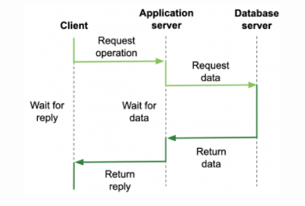
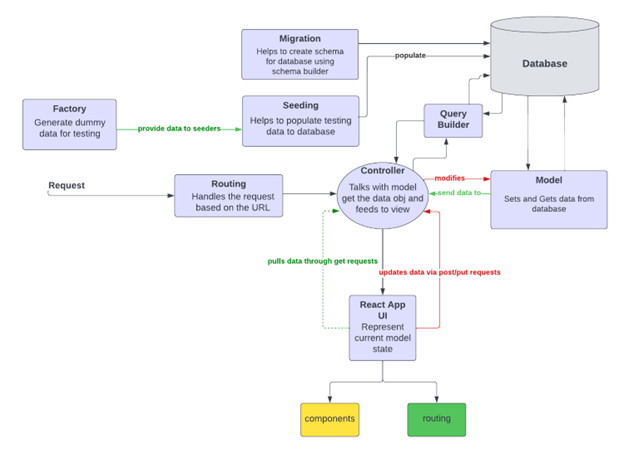

 # Bug Tracking System Architecture 

## 1. System Architecture 
 The Client-server system architecture was chosen to represent our system architecture; it belongs to the centralized organization.
A server is a process implementing a specific service (e.g. Database service).
A client is a process requesting that service from a server, the client sends the request and waits for a reply (request-reply behavior).

We use 3-tiered client-server architecture which means the application is spread across three machines, one client, and two servers. One of the servers may need input from the other server to process the client request, acting as a client.

  

Figure 1.1

Some of the advantages of three-tier architecture include scalability, improved security, reusability, improved availability, and data integrity.

Figure 1.2

## 2. Application Architecture
The bug tracking system is considered one of the examples of the Transaction processing systems which are designed to process user requests from a database, or requests to update databases. They are usually interactive systems in which users make asynchronous requests for services.

### 2.1. Application Architecture used

 Our web application follows the model-view-controller **(MVC)** architectural pattern. Therefore, Laravel, which is an open-source PHP web framework, is intended for this kind of development. In this architecture we use :

 * **Controller**: which handles user requests and retrieves data, by leveraging Models.
* **Model:** to interact with databases and retrieve objects’ information.
* **Views:** to render pages developed through React and create various components 
Additionally, as shown in fig 2.1 :
* **routers:** are used to map URLs to designated controller actions.
* **Database seeding:** Laravel lets you populate your development and production database with dummy data which you then can use to test your API endpoints. You can create a seed class.
* **Migration:** by supplying that --migration option when generating the model, Laravel also generated a database migration file for creating database tables.
  
  
  To make our web application more simple, scalable, effective, safe, and reliable we could also integrate **REST** architecture. To implement Rest architecture we will use the Restful API.
<<<<<<< Updated upstream

=======
  
>>>>>>> Stashed changes

Figure 2.1

**In A Nutshell**, when a client sends a request to Laravel Restful API through HTTP, the webserver first receives the request and passes it through to PHP Engine,  then the actual execution starts from Laravel initialization routines.  The Laravel initialize routines finish some configuration,  the request is then passed  To the middleware engine for filtering, after filtering there comes the core routing component responsible for request dispatching according to the route configuration table, finally the MVC controller takes over the dispatched request. In general, the controller is responsible for application logic execution and inquiring about the model for data fetch and persistent, the view React components take over the last piece of work for rendering the page, at the end of the process only JSON data is exchanged and will be returned. Laravel provides a  powerful ORM framework for relational database manipulation, the model depends heavily rely on ORM for data processing as shown in figure 2.1 
  

